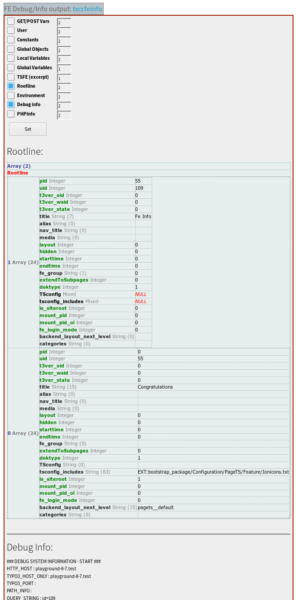

.. ==================================================
.. FOR YOUR INFORMATION
.. --------------------------------------------------
.. -*- coding: utf-8 -*- with BOM.

.. include:: ../Includes.txt

Introduction
============

What does it do?
----------------

The plugin shows system variables and other debug data which might be interesting for frontend debugging and development.

This is very old code but I thought it might still be helpful.

By the way if you have old code which you want to make work again, you might be interested in this tool: https://github.com/colorcube/typo3_convert_extension_to_namespaces

Screenshots
-----------

The plugin creates output like this:

    example plugin output
